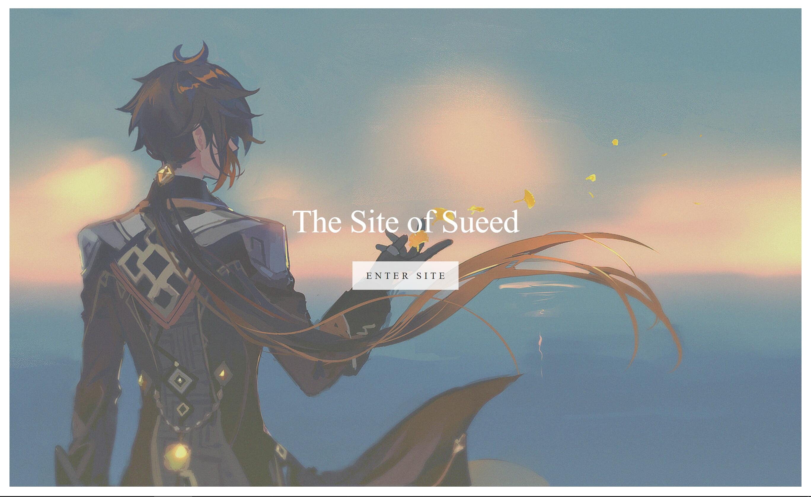
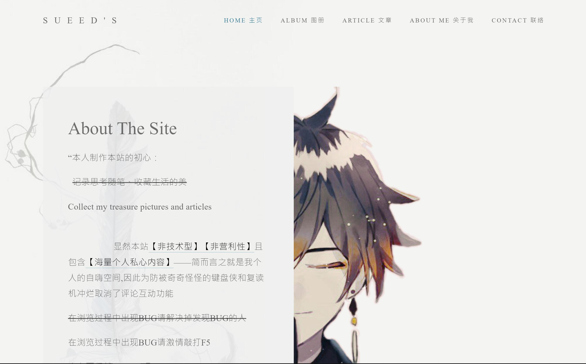
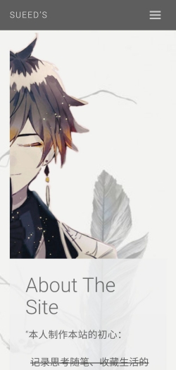

## Sueed's Site  

### ⚙️环境配置
* 系统：Windows 10
* 软件：Pycharm 2020.3.3
* 本地开发：Python3.8.5 + Django3.2 + MySQL8.0
* 服务器部署：CentOS 7.6 64bit + Nginx 1.18 + uWSGI 2.0.19.1

### 💻技术要点

* 前端使用爬虫工具爬取目标模板并作修缮取舍
* 后端使用Django3.2实现基本的MTV开发
* 通过自定义标签函数Simple_Tag实现数据交互
* 应用PIL图像操作辅助实现图片自适应渲染
* 动态样式感知实现PC端和移动端兼容响应

### 主页显示效果

### 🖥️ PC端显示效果

### 📱 移动端显示效果

### 😗 网站地址
* <a href="https://www.sueed.love/">The Site of Sueed</a>

### 👩‍🏫 建站教程
* 【年中重新建站，敬请期待啦】
